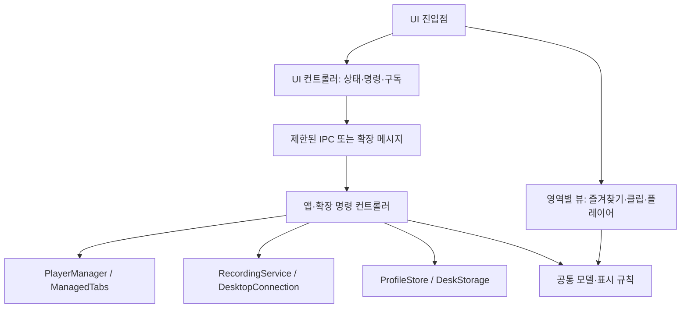

# 치지직 데스크 유지보수 안내

이 문서는 기능 목록이 아니라 소스 코드의 책임과 의존성 경계를 설명한다. 데스크톱 앱과 Chrome 확장은 플랫폼에 필요한 동작만 각각 구현하고, 입력·설정·시청 보상·표시 규칙은 공통 모듈을 사용한다. 기존 Python 봇은 별도 실행 프로그램이며 이 구조에 의존하지 않는다.

진입 파일은 객체 생성·연결·종료를 조립한다. 각 서비스는 자신의 상태와 비동기 작업 수명을 소유하고, 다른 모듈은 공개 메서드와 이벤트를 통해 사용한다. 화면의 요청 처리와 상태는 컨트롤러가, DOM과 검색 캐시·이벤트는 각 뷰가 관리한다. 공통 가변 객체 전체를 넘기거나 상속·mixin으로 파일만 분할하지 않는다.

## 코드 경계

| 위치 | 책임 | 피해야 할 의존성 |
| --- | --- | --- |
| `../browser-extension/shared/channels.js` | 채널 입력, 슬롯·배치·저장 길이 상수, 기존 설정 정규화 | Electron, Chrome API, 파일·네트워크 |
| `../browser-extension/shared/presentation.js` | 검색, 보관 상태·통나무·클립 표시 문구 | DOM 변경, 파일·네트워크 |
| `../browser-extension/shared/rewards.js` | 공식 시청 보상 버튼 감지, 중복 수령 방지, 취소·결과 확인 | 쿠키·앱 토큰, 플랫폼별 IPC |
| `main.cjs` | Electron 환경 초기화, 서비스 조립, IPC 권한 검사, 종료 연결 | 플레이어·녹화 상태 직접 변경, 화면 렌더링 |
| `lib/desk-controller.cjs` | 설정·즐겨찾기, 사용자 명령 조합, 슬롯별 작업 잠금 | 직접 WebContentsView 조작, FFmpeg 프로세스 제어 |
| `lib/clip-library.cjs` | 클립 등록·복원·메타데이터 편집, 전체 인덱스 필터·페이지 조회, 검증된 파일 열기·위치 표시 | FFmpeg, 채팅 감지 |
| `lib/watch-workspace.cjs` | 시청 모음 저장·삭제, 전체 슬롯 잠금 안에서 모음 적용 | WebContentsView, FFmpeg 직접 제어 |
| `../browser-extension/lib/watch-workspace.js` | 독립/앱 연결 시청 모음, 관리 탭을 통한 모음 적용 | 탭 레코드 직접 변경, 화면 DOM |
| `lib/player-manager.cjs` | 네이티브 플레이어 소유권·페이지 상태·소리·크기·통나무 연결 수명 | 프로필 파일, 녹화 구현 |
| `lib/recording-service.cjs` | 방송 재생 정보, 미디어 중계 주소 수명, 녹화 준비·저장 상태·종료 | UI, 즐겨찾기·배치 설정 변경 |
| `lib/auth-session.cjs` | 로그인 창 수명, 허용된 이동, 로그인 상태 조회·중복 요청·취소 | 녹화·플레이어 직접 제어 |
| `lib/profile-store.cjs` | 고정된 설정·클립 문서 읽기, 스냅샷 순차 저장, 임시 파일 교체 | Electron 창, 사용자 화면 상태 |
| `lib/replay-buffer.cjs` | 녹화 세션·세대, recorder 프로세스·중단, 수동/범위 저장 조합 | UI, 앱 설정 변경 |
| `lib/segment-store.cjs` | 완료 manifest·파일, 시간·용량 제한, 연속 구간 선택·스냅샷 | UI, 채팅, MP4 프로세스 |
| `lib/clip-exporter.cjs` | 스냅샷 MP4 변환, 시간 초과·취소, 임시 파일의 원자적 교체 | 진행 중 녹화 파일, 설정 |
| `lib/media-gateway.cjs` | 로그인 세션을 사용하는 제한된 미디어 중계 | UI, 앱 설정 변경 |
| `lib/auto-clip-service.cjs`, `lib/chat-trigger.cjs` | 채팅 통계, 쿨다운·한도·세대, 미디어 진행에 따른 대기 범위 | 페이지·파일·네트워크 직접 접근 |
| `lib/chat-host.cjs` | 격리된 페이지의 읽기 전용 observer 수명, 고정된 bounded batch 조회 | 임의 페이지 IPC·명령 |
| `../browser-extension/shared/chat-observer.js` | 공식 채팅 DOM 관찰, 기존 메시지 seed, 중복 제거·제한된 배치 | 로그인·쿠키·앱 연결 토큰 |
| `../browser-extension/lib/chat-service.js`, `content/chat-adapter.js` | 관리 탭·채널·세대 검증, 고정 채팅 전달·heartbeat | 임의 RPC 메서드, 페이지에 연결 토큰 전달 |
| `ui/renderer.mjs` | 앱 화면 모듈 생성, 상태 구독 연결, 종료 정리 | 직접 명령 처리·DOM 영역 렌더링 |
| `ui/controller.mjs` | 데스크톱 화면 상태, 실행 중 명령, IPC 상태 구독·해제 | DOM 렌더링, 직접 파일 접근 |
| `ui/`의 뷰 모듈 | 담당 영역의 DOM·검색 캐시·이벤트, 플레이어 위치 측정 | 백엔드 서비스, 로그인 쿠키 |
| `../browser-extension/lib/core.js` | 명령 순서, 독립 모드·앱 연결 모드의 작업 조합 | 탭 레코드·저장 데이터 직접 변경, DOM |
| `../browser-extension/lib/managed-tabs.js` | 관리 탭 채택·복원·해제, 슬롯 레코드·음소거 상태 | 앱 연결 토큰, 화면 DOM |
| `../browser-extension/lib/desk-storage.js` | 기존 저장 키로 즐겨찾기·설정 저장, 부분 세션 쓰기 순서 | 방송 탭 조작, 네트워크 요청 |
| `../browser-extension/lib/desktop-connection.js` | 앱 연결·해제, 연결 코드·원격 상태 소유, RPC와 응답 정규화 | 콘텐츠 스크립트로 연결 토큰 전달 |
| `../browser-extension/lib/reward-service.js` | 관리 탭 검증, 보유량 GET, 통나무 상태 | 임의 URL 요청, 앱 로그인 |
| `../browser-extension/lib/window-layout.js` | 배치 계산, 방송 창 배치·복원 | 다른 탭이 함께 있는 창의 임의 이동 |
| `../browser-extension/panel.js` | 패널 모듈 생성, 상태 구독 연결, 종료 정리 | 직접 Chrome 메시지 처리·영역 렌더링 |
| `../browser-extension/ui/` | 패널 상태·요청 컨트롤러와 영역별 뷰 | 권한 있는 백엔드 직접 호출 |
| `../browser-extension/shared/ui/` | 공통 모델·DOM 도구, 즐겨찾기 편집·시청 모음·클립 검색/페이지/편집 상태와 이벤트 수명 | 플랫폼 서비스, 앱 상태 소유 |

공통 파일은 확장 폴더 안에 둔다. 압축해제된 확장은 폴더 밖 파일을 포함할 수 없으므로, 데스크톱이 같은 소스를 참조한다. 같은 규칙을 양쪽에 복사하지 않는다.

## 호출 흐름



뷰는 `render(snapshot)`으로 상태를 읽고, 생성 시 받은 명령 콜백으로 사용자 입력을 전달한다. 컨트롤러는 뷰를 import하지 않는다. 진입점이 구독을 연결하고 종료 시 구독·리스너·타이머를 정리한다. 데스크톱과 Chrome의 플랫폼 API 차이는 각 컨트롤러와 서비스 안에 둔다.

양쪽 화면의 `favorites.mjs`와 `clips.mjs`는 목록·검색 입력·클릭 처리를 맡는다. 앱의 `players.mjs`와 확장의 `slots.mjs`는 시청 자리의 표시·입력을 맡는다. 앱의 `bounds.mjs`는 네이티브 플레이어 위치 측정과 갱신 요청을, 확장의 `controller.mjs`는 패널 표시 여부에 따른 조회 타이머를 소유한다. 상태가 갱신되어도 검색 입력을 유지하고, 화면 종료 후 늦게 도착한 응답을 적용하지 않는다.

백엔드의 기존 IPC/RPC 명령명과 저장 형식은 유지한다. 데스크톱 `DeskController.commands()`와 확장 `DeskController.handle()`이 진입 경계이며, 화면에 내부 서비스 객체를 전달하지 않는다. 서비스를 수정하는 테스트는 명령의 결과와 자원 정리를 검증한다.

## 설정과 명령

- 사용자 설정을 읽을 때는 `normalizeSettings()`로 기존 버전의 누락되거나 잘못된 값을 복구한다. 새 설정에는 기본값을 둔다.
- 사용자 명령에서는 잘못된 입력을 거부한다. 저장 길이는 `CLIP_DURATIONS`와 `validClipSeconds()`를 기준으로 15·30·60초만 받는다. 설정 기본값은 30초다.
- `setClipSeconds(number)`는 앞으로 저장할 구간 길이를 바꾼다. 이미 저장한 파일이나 진행 중인 저장 요청은 바꾸지 않는다. 앱 연결 중인 Chrome은 앱 설정을 공유하고, 독립 모드는 Chrome 안에 저장한다.
- 자동 수령 설정과 로그인은 각 클라이언트가 따로 관리한다. Chrome에 앱 쿠키나 계정 닉네임을 전달하지 않는다.
- 배치·메인 방송·저장 길이는 복원하지만, 앱 재시작 때 소리와 구간 보관은 자동으로 켜지 않는다.
- 검색어는 화면의 일시 상태다. 상태 갱신으로 입력을 지우거나 즐겨찾기·클립 자체를 수정하지 않는다. 정기 상태의 클립은 최신 100개지만 `queryClips`는 전체 인덱스를 조회한다. 한 요청은 최대 100개이며 UI는 50개씩 더 표시한다. `clipRevision`으로 변경 시 다시 조회하고 서로 다른 버전의 페이지를 섞지 않는다.
- `watchPresets`는 최대 10개의 이름·A–D 채널·배치·메인 번호만 저장한다. 로그인·소리·보관은 포함하지 않는다. 적용 시 모든 슬롯을 잠그고 실제로 바뀌는 자리만 종료·교체한다. Chrome은 기존 관리 탭 소유권과 다른 사용자 탭을 보존한다.
- `updateClip`은 검증한 제목·별표 메타데이터만 변경한다. 파일명과 경로는 변경하지 않는다. `showClipInFolder`는 기존 파일 경로 검증을 거쳐 플랫폼에 전달한다. Chrome 응답에는 실제 경로·인증정보를 포함하지 않는다.

## 비동기 작업에서 유지할 조건

1. 페이지·채널·슬롯이 바뀐 뒤 이전 요청 결과를 현재 상태에 적용하지 않는다.
2. 보상 감시·네트워크 조회·녹화 프로세스·타이머는 소유한 서비스가 취소하고 정리한다.
3. 슬롯 제거 시 비동기 녹화 종료를 기다리기 전에 플레이어 이벤트 소유권을 해제한다.
4. 보유량 조회 실패를 0으로 표시하지 않고, 수령 버튼 클릭만으로 성공을 기록하지 않는다.
5. 다른 탭이 들어온 Chrome 창을 확장 전용 창으로 간주하지 않는다. 같은 창을 반복 배치해도 크기가 계속 줄지 않아야 한다.
6. 설정 저장은 요청 당시 스냅샷을 순서대로 저장한다. 한 번 실패한 뒤의 저장도 다시 시도할 수 있어야 한다.
7. 자동 클립의 채팅 관찰 세대와 녹화 세대는 별개다. 설정 변경·채널 전환·녹화 종료 후 이전 세대의 메시지와 대기 구간을 적용하지 않는다.
8. 자동 저장은 `mark()`로 확인한 완료 미디어 시간을 기준으로 잡는다. `saveRange()`는 전체 범위가 연속적으로 남아 있어야 하며 부족한 분량을 잘라 저장하지 않는다. 수동 최근 구간 저장의 기존 동작은 유지한다.
9. 채팅 본문은 감지 후 버리고, 카운트와 제한된 메시지 ID만 메모리에 남긴다. 인덱스에는 고정된 감지 유형만 저장한다. 처음 로드·컨테이너 교체 때 보이는 채팅은 과거 기록으로 처리한다.

## 확인 방법

프로젝트 루트에서 다음 한 명령으로 JavaScript 문법과 양쪽 자동 테스트를 확인한다.

```powershell
node scripts/check-desk.cjs
```

`desktop/` 또는 `browser-extension/`에서 `npm run check`를 실행해도 같다. 이 검사는 Electron·Chrome 창을 열지 않으며 실제 계정을 사용하지 않는다. 새 테스트 파일은 각 `tests/` 폴더에 `*.test.cjs`로 추가한다.

녹화·연결 경로를 바꿨을 때는 `desktop/`에서 `npm run test:clip-lengths`로 생성한 영상의 15·30·60초 RPC 저장과 FFmpeg 디코딩을 추가 확인한다. 기본 30초만 확인하려면 `npm run test:browser-replay`를 사용한다. 실제 UI·네이버 로그인·치지직 보상 동작은 이 테스트로 확인되지 않는다. `test:smoke`, `test:auth`, `test:session-replay`는 Electron을 실행하므로 화면 조작 없이 검증할 때는 실행하지 않는다.

순수 규칙은 공통 모듈 단위로, 플랫폼 동작은 가짜 Chrome API·Electron 객체로, 파일과 녹화 처리는 격리한 임시 경로로 검증한다. 외부 서비스 구조가 바뀌면 먼저 [통나무 구현 근거](../browser-extension/shared/REWARDS-SOURCES.md)와 해당 어댑터를 확인한다.

## 모듈 경계를 지키는 검사

`browser-extension/tests/module-boundaries.test.cjs`는 실제 프로그램을 실행하지 않고 정적으로 선언된 `import`·`export from`·`require` 경로를 검사한다.

- 상대 참조 파일이 실제로 존재하고 저장소 안에 있어야 한다.
- 모듈 간 순환 참조가 없어야 한다.
- 공통 규칙은 공통 코드에만 의존한다. Electron·Chrome 플랫폼 구현을 가져오지 않는다.
- 플랫폼 서비스는 UI나 진입 파일을 역으로 가져오지 않는다.
- UI는 권한이 있는 백엔드 서비스 파일을 직접 가져오지 않는다.
- Chrome 확장은 데스크톱 패키지에 의존하지 않는다.

파일을 나누거나 옮기면 이 검사와 HTML 진입점·패키징 검사도 함께 통과해야 한다. `.cjs`, `.js`, `.mjs`는 모두 `npm run check`의 문법 검사 대상이다.

자동 저장을 수정했을 때는 `npm run test:auto-clip --prefix desktop`도 실행한다. 이 검사는 가짜 채팅 감지와 실제 FFmpeg 합성 영상을 연결해 후행 영상 대기·중복 방지·세대 교체·MP4 영상과 음성 디코딩을 검증한다. 화면 컨트롤러·뷰 검사는 가짜 DOM·플랫폼 객체를 사용하며 실제 Electron·Chrome UI를 실행하지 않는다.

배포 코드는 `electron-builder.cjs`와 `scripts/verify-package.cjs`(앱), `../browser-extension/scripts/package.cjs`(확장), `../scripts/release-bundle.cjs`(버전·릴리스 파일·체크섬)로 나뉜다. 배포 설정이나 상대 경로를 변경하면 실제 패키징 검사도 통과해야 한다. [CI/CD와 배포 안내](../docs/RELEASING.md)
